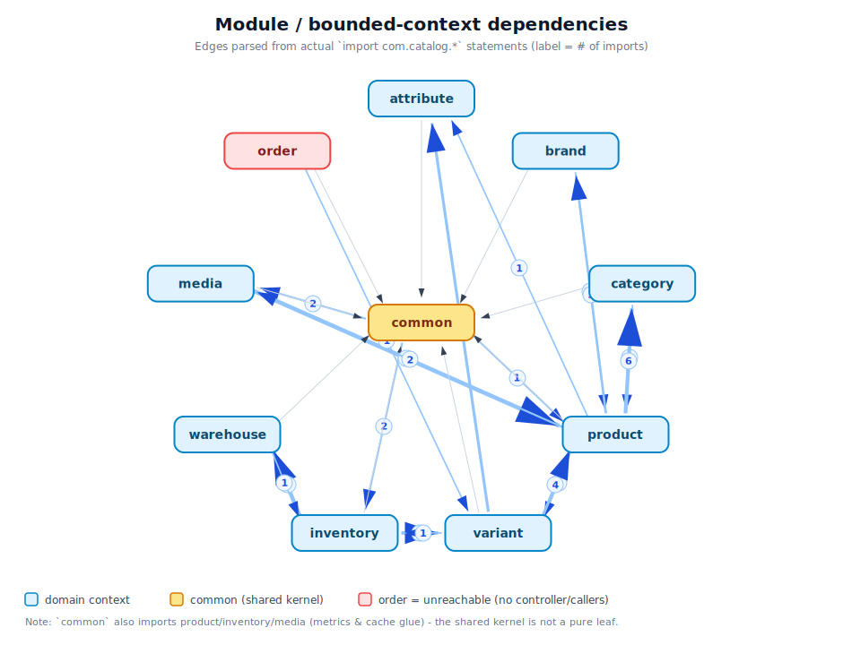
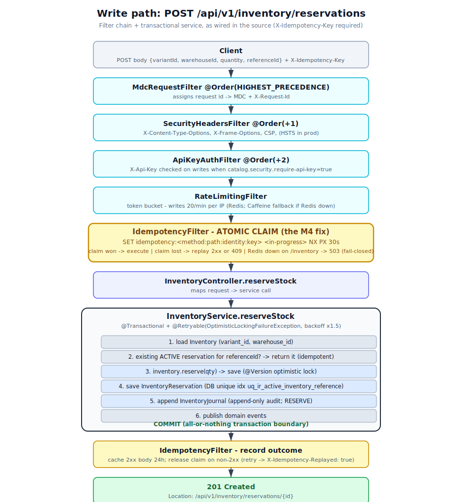
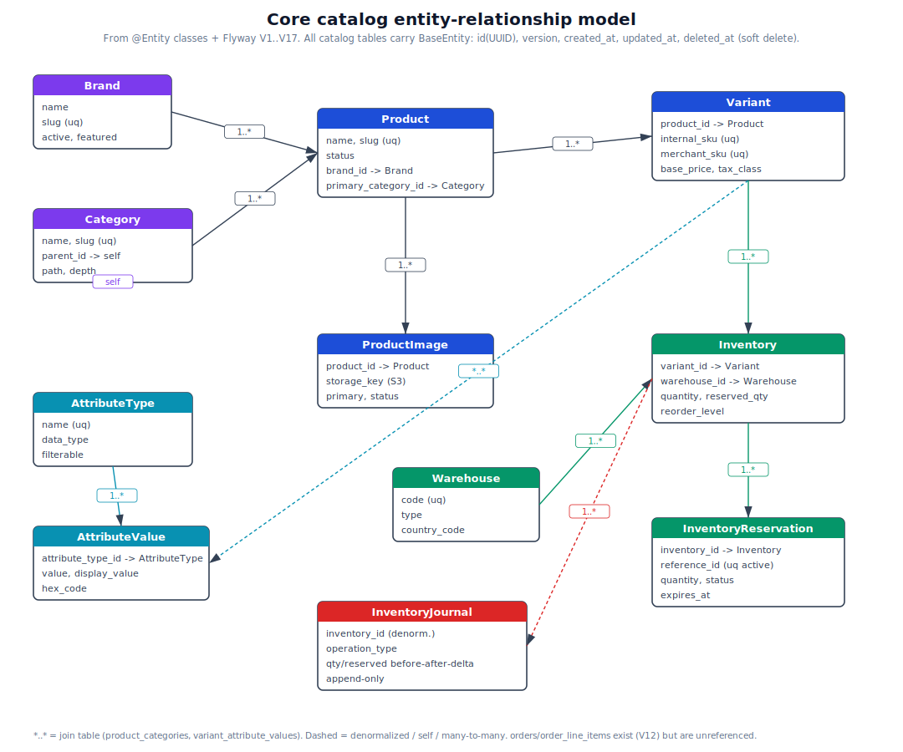

# Catalog API

A modular-monolith REST API for a product catalog: products and variants, brands,
categories (materialized-path tree), attributes, warehouses, and per-warehouse
inventory with reservations, transfers, and an append-only journal. Built on Spring
Boot 3.4 / Java 21, backed by PostgreSQL (storage + full-text/trigram search) and
Redis (rate-limit buckets + idempotency claims). It is designed for internal /
service-to-service use behind a gateway, not as a public unauthenticated endpoint.

> **Status of this document.** Every capability below is traceable to a file in this
> branch. Numbers under [Testing](#testing) come from running `mvn clean verify` on
> the current HEAD, not from a prior report. Things that are claimed elsewhere in the
> repo but are *not* actually built (or not enforced) are called out in
> [Known limitations](#known-limitations). See [`DOCS_AUDIT_2026-07.md`](DOCS_AUDIT_2026-07.md)
> for the full claim-by-claim audit behind this rewrite.

---

## Architecture

The service is a single deployable (`spring-boot:run` / one JAR). Code is organized by
**bounded context** (`product`, `variant`, `brand`, `category`, `attribute`,
`inventory`, `warehouse`, `media`, `order`), each split into `api` (controllers +
record DTOs), `application` (use-case services), `domain` (JPA entities + rules), and
`infrastructure` (Spring Data repositories). Cross-context types are shared through
`common`.

The diagram below is **generated from the actual `import com.catalog.*` statements** by
[`docs/images/generate_diagrams.py`](docs/images/generate_diagrams.py) — re-run it after
refactors to keep it honest.



What this diagram makes visible and honest about:
- **`product` is the hub** (variant, media, brand, category, attribute all connect to it).
- **`common` is not a pure leaf** — it imports back into `product`/`inventory`/`media`
  (metrics and cache-eviction glue), so it is a shared kernel with some inward coupling,
  not a dependency-free base layer.
- **`order` is unreachable** — `order/application/OrderService.java` has no controller and
  no callers (see [Known limitations](#known-limitations)).

### Representative write path — idempotent inventory reservation

This traces the real filter chain (`@Order` values as declared) and
`InventoryService.reserveStock`. The idempotency **atomic claim** is drawn as its own
stage because it is a specific, defensible design point (see
[Key design decisions](#key-design-decisions)).



### Core data model

Generated from the `@Entity` classes and Flyway migrations `V1`–`V17`. All catalog
tables inherit `BaseEntity` (`id` UUID, `version`, `created_at`, `updated_at`,
`deleted_at` soft-delete). `inventory_journal` is the exception — it is deliberately not
a `BaseEntity` (see design decisions).



---

## Tech stack

Versions are taken directly from [`pom.xml`](pom.xml) (and the Spring Boot 3.4.5 BOM
where a version is managed transitively).

| Area | Technology | Version | Source |
|------|------------|---------|--------|
| Language | Java | 21 | `pom.xml` `<java.version>` |
| Framework | Spring Boot | 3.4.5 | parent POM |
| Web / JPA / Redis / Validation / AOP / Actuator | Spring Boot starters | 3.4.5 | BOM |
| Database | PostgreSQL | 16 (`postgres:16-alpine`) | `docker-compose.yml`, Testcontainers |
| Migrations | Flyway | 10.22.0 | `pom.xml` |
| Cache (local) | Caffeine | via BOM | `pom.xml` |
| Cache / rate-limit / idempotency store | Redis 7 (`redis:7-alpine`), Lettuce | via BOM | `docker-compose.yml` |
| Query | QueryDSL (jakarta) | 5.1.0 | `pom.xml` |
| Mapping | MapStruct | 1.6.3 | `pom.xml` |
| Boilerplate | Lombok | 1.18.36 | `pom.xml` |
| Object storage | AWS SDK v2 (S3) | BOM 2.25.11 | `pom.xml` |
| Rate limiting | Bucket4j | 8.10.1 | `pom.xml` |
| Resilience | Resilience4j (Spring Boot 3) | 2.2.0 | `pom.xml`, `resilience4j.yml` |
| CSV | commons-csv | 1.10.0 | `pom.xml` |
| Tracing / metrics | Micrometer Tracing (OTel bridge), OTLP exporter, Prometheus registry | via BOM | `pom.xml` |
| Logging | logstash-logback-encoder | 7.4 | `pom.xml` |
| Tests | JUnit 5, Testcontainers, WireMock | TC 1.21.4, WireMock 3.0.4 | `pom.xml` |
| Coverage | JaCoCo | 0.8.15 | `pom.xml` |
| Dependency CVE scan | OWASP dependency-check | 9.0.9 | `pom.xml` |
| SQL logging (local profile only) | P6Spy | 1.9.1 | `pom.xml` `local` profile |

Runtime dependencies: **PostgreSQL 16** and **Redis 7**. **Docker is required to run the
test suite** (Testcontainers starts real Postgres containers).

---

## Key design decisions

Five decisions that are non-obvious, with the tradeoff each one accepts.

1. **Atomic Redis `SET NX` idempotency claim, with an explicit Redis-down policy —
   not a DB unique constraint alone.**
   `IdempotencyFilter` claims the key with a single `setIfAbsent` (`SET key <in-progress>
   NX PX 30s`) *before* executing; exactly one concurrent retry wins, losers replay the
   cached 2xx or get `409`. When Redis is unreachable it **fails closed (503)** for
   stock/money paths (`/api/v1/inventory`, `/transfers`, bulk apply) and **fails open**
   for CRUD guarded by DB unique constraints.
   *Tradeoff:* state-critical writes now hard-depend on Redis (they 503 during a Redis
   outage), in exchange for closing a check-then-act double-execute race that a DB unique
   index cannot catch for non-unique resources. — `common/security/IdempotencyFilter.java`

2. **Denormalized `product_search_projection` + Postgres GIN (`tsvector`) + `pg_trgm`,
   not Elasticsearch.**
   Search reads a denormalized projection table with a GIN full-text index and trigram
   indexes; the projection is refreshed from domain events **after the writing
   transaction commits** (`@TransactionalEventListener(AFTER_COMMIT)`).
   *Tradeoff:* avoids Elasticsearch's operational cost and dual-write/sync problem, but
   search is **eventually consistent** (a committed write is briefly not yet searchable)
   and scale is bounded by Postgres — [ADR-0002](docs/adr/0002-postgresql-native-search-over-elasticsearch.md)
   targets up to ~100k products. — `product/application/search/*`, `db/migration/V9__*.sql`

3. **Append-only `inventory_journal` that is not a `BaseEntity`.**
   Every stock change writes an immutable journal row (before/after/delta for both
   physical and reserved quantity, operation type, actor, reference). The entity has no
   update path and no soft-delete.
   *Tradeoff:* a full audit/reconciliation trail at the cost of extra write volume.
   **Caveat (see limitations):** immutability is enforced by *application convention*
   only — the claimed database-level `REVOKE UPDATE/DELETE` is **not** present in the
   migrations. — `inventory/domain/InventoryJournal.java`, `db/migration/V8__*.sql`

4. **Optimistic locking (`@Version`) + bounded exponential-backoff retry for inventory
   concurrency, not pessimistic row locks.**
   Inventory updates use JPA `@Version`; `InventoryService` is `@Retryable` on
   `OptimisticLockingFailureException` with configurable attempts/backoff
   (`CATALOG_INVENTORY_RETRY_*`).
   *Tradeoff:* high throughput and no long-held row locks under low contention, but under
   high contention a reservation retries up to N times and can still fail with a conflict.
   — `common/audit/BaseEntity.java`, `inventory/application/InventoryService.java`

5. **Modular monolith by bounded context, not microservices.**
   One deploy unit, in-process calls, one database, transactional integrity within a
   context ([ADR-0001](docs/adr/0001-modular-monolith-over-microservices.md)).
   *Tradeoff:* simple to run and reason about, but contexts share a process and a schema,
   and `common` has some inward coupling (see the module diagram), so a future extraction
   into services is not free.

---

## API overview

Base path `/api/v1`. Success responses use the envelope
`{ "success": true, "message": <string|null>, "data": <payload>, "timestamp": <instant> }`;
errors are sanitized by `GlobalExceptionHandler`. Mutating requests (`POST/PUT/PATCH/DELETE`
under `/api/`) require an `X-Idempotency-Key` header (missing → `400`); when
`CATALOG_REQUIRE_API_KEY=true` they also require `X-Api-Key` (missing/invalid → `401`).
All endpoints are rate limited (`429` with `Retry-After: 60`). Endpoints below are read
straight from the controllers.

| Context | Endpoints (controller) |
|---------|------------------------|
| **Products** (`ProductController`) | `POST /products`, `GET /products/{id}`, `GET /products/slug/{slug}`, `PUT /products/{id}`, `PATCH /products/{id}/status`, `DELETE /products/{id}`, `POST\|DELETE /products/{id}/categories/{categoryId}`, `GET /products/search` (cursor), `GET /products/admin` (paged), `POST /products/bulk-update`, `GET /products/bulk-update/{jobId}` |
| **Variants** (`VariantController`) | `POST\|GET /products/{productId}/variants`, `GET\|PUT\|DELETE /products/{productId}/variants/{id}`, `PATCH /products/{productId}/variants/{id}/status` |
| **Brands** (`BrandController`) | `POST\|GET /brands`, `GET /brands/featured`, `GET /brands/{id}`, `GET /brands/slug/{slug}`, `PUT\|DELETE /brands/{id}` |
| **Categories** (`CategoryController`) | `POST /categories`, `GET /categories/{id}`, `GET /categories/slug/{slug}`, `GET /categories/tree`, `GET /categories/{id}/subtree`, `GET /categories/{id}/children`, `GET /categories/{id}/ancestors`, `PUT\|DELETE /categories/{id}` |
| **Attributes** (`AttributeController`) | `POST\|GET /attributes/types`, `POST\|GET /attributes/types/{typeId}/values` |
| **Warehouses** (`WarehouseController`) | `POST\|GET /warehouses`, `GET /warehouses/{id}`, `PUT\|PATCH /warehouses/{id}` |
| **Inventory** (`InventoryController`) | `POST /inventory`, `GET /inventory/{id}`, `GET /variants/{variantId}/inventory`, `GET /variants/{variantId}/inventory/warehouses/{warehouseId}`, `PATCH /inventory/{id}/stock`, `POST /inventory/reservations`, `POST /inventory/reservations/{id}/complete`, `POST /inventory/reservations/{id}/cancel`, `POST /inventory/transfers` (also `POST /transfers`), `GET /inventory/{inventoryId}/journal` |
| **Bulk inventory import** (`BulkImportController`) | `POST /inventory/bulk-imports`, `GET /inventory/bulk-imports/{jobId}` |
| **Ops** (Actuator) | `GET /actuator/health`, `/info`, `/metrics`, `/prometheus` (narrowed to `health,info,prometheus` under `prod`) |

---

## Running locally

Prerequisites: **JDK 21**, **Maven 3.9+** (a repo-local `.tools/apache-maven-3.9.9` is
present), **Docker** (for Postgres/Redis and for tests).

```bash
# 1. Start backing services (Postgres 16 + Redis 7)
make docker-up          # docker-compose up -d postgres redis

# 2. Configure environment (copy and edit)
cp .env.example .env     # DB_URL/DB_USERNAME/DB_PASSWORD, REDIS_*, etc.

# 3. Run the app (default profile = local; API-key auth OFF locally)
mvn spring-boot:run

# 4. Smoke test
curl localhost:8080/actuator/health           # {"status":"UP",...}
curl localhost:8080/api/v1/categories/tree     # envelope with data: []
```

Defaults (from `application.yml` / `.env.example`): port `8080`,
`jdbc:postgresql://localhost:5432/catalog_db`, Redis `localhost:6379`, CORS
`http://localhost:3000`, `CATALOG_REQUIRE_API_KEY=false`. Full container run
(`docker-compose up --build`) starts the `app` service with `SPRING_PROFILES_ACTIVE=prod`,
which turns **API-key auth on** and narrows Actuator exposure.

---

## Testing

```bash
mvn clean verify -Ddependency-check.skip=true   # unit + integration + merged coverage
mvn test                                        # unit tests only
mvn verify                                       # add the OWASP CVE gate (CVSS >= 7 fails)
```

Integration tests (`*IT`) use Testcontainers and **require a running Docker daemon**;
they start `postgres:16-alpine` automatically. The merged JaCoCo report is written to
`target/site/jacoco-merged/index.html`.

**Current numbers — from `mvn clean verify` on this HEAD (2026-07-07), not a prior report:**

| Metric | Value |
|--------|-------|
| Build | `BUILD SUCCESS` (~2 min) |
| Unit tests (surefire) | **109**, 0 failures / 0 errors / 0 skipped |
| Integration tests (failsafe) | **129**, 0 failures / 0 errors / 0 skipped |
| Instruction coverage (merged) | **74.1 %** (11,720 / 15,816) |
| Branch coverage (merged) | **60.6 %** (594 / 981) |
| Line coverage (merged) | **74.3 %** (2,537 / 3,413) |
| Method coverage (merged) | **58.3 %** (714 / 1,224) |

Coverage excludes generated sources (QueryDSL `Q*`, MapStruct `*MapperImpl`,
`CatalogApplication`) — see the JaCoCo config in `pom.xml`.

**Honestly weak areas** (from the per-package JaCoCo report — do not read the headline
74 % as uniform):
- **Media pipeline** is largely untested — `media.domain` 0 %, `media.product.application`
  ~2 %, `media.config` ~5 %. The S3/image path has the least coverage in the codebase.
- **Some application services are thin** — `attribute.application` and `category.application`
  ~4 %.
- **Request/response DTO records, domain event records, and observability filters** are at
  or near 0 % (`*.api.dto.request/response`, `*.event`, `observability.filter` ~7 %).
- **Method coverage (58 %) is the weakest headline metric** — many entity/DTO accessors and
  glue methods are never exercised.
- Well-covered: controllers, core `product`/`inventory` services, repositories, and the
  concurrency/transfer/reservation paths.

---

## Known limitations

These are real and current on this branch. Sourced from the code and from
[`PRR_AUDIT_2026-07.md`](PRR_AUDIT_2026-07.md); a README that lists none on a system like
this would be the actual red flag.

- **Inventory journal immutability is convention, not enforced.** `InventoryJournal.java`
  and `db/migration/V8` *comment* that `UPDATE`/`DELETE` are revoked for the app DB user,
  but **no `REVOKE`, trigger, or rule exists in any migration**. A direct SQL
  `UPDATE`/`DELETE` by the application role is not prevented at the database layer; the
  append-only guarantee currently rests on the service only ever inserting.
- **`order` subsystem is dead code.** `order/application/OrderService.java` has no
  controller and no callers; the `orders` / `order_line_items` tables (`V12`) are never
  written by any API path. Either wire it or delete it and the migration weight.
- **Actuator is over-exposed outside `prod`.** Base `application.yml` exposes
  `env,loggers` with `show-details: always`; only `application-prod.yml` narrows to
  `health,info,prometheus`. Actuator is unauthenticated (`ApiKeyAuthFilter` guards only
  `/api/`), so any non-`prod` instance reachable on a network can leak config via
  `/actuator/env`.
- **API-key auth exempts all reads.** `ApiKeyAuthFilter` skips `GET/HEAD/OPTIONS` even
  when `require-api-key=true`, so every read endpoint is unauthenticated. This is fine
  only if a gateway enforces read auth; if this is the sole control, catalog data is
  world-readable.
- **Image processing holds a DB transaction across S3 + decode.**
  `media/product/application/ImageProcessingService.java:31` runs `@Transactional` around
  `verifyAndGetMetadata` / `openStream` / `ImageIO.read`, pinning a Hikari connection for
  the whole network + CPU call. Concurrent uploads during storage slowness can starve the
  pool. (S3 timeouts and a circuit breaker exist and bound the call; the transaction
  coupling does not.)
- **Search-result cache silently drops on deserialization drift.**
  `ProductSearchCacheService` catches a failed deserialize of a cached `CursorPage`, evicts
  the entry, and refetches from the DB — correct and safe, but it means a change to
  `ProductCardDto`/`CursorPage` shape invalidates cached entries invisibly. Cursor pages and
  `inStock` queries are deliberately **not cached**.
- **`ReservationCleanupJob` has no distributed lock.** The `@Scheduled` cleanup runs on
  every instance; correctness is preserved by a locked re-check, but it is duplicated work
  across a cluster (a `ShedLock` would remove it).
- **Rate limiting fails open to per-node buckets.** If Redis is down, `RateLimitingFilter`
  falls back to in-memory Bucket4j buckets, so the effective limit becomes per-instance
  rather than global.
- **Coverage is uneven**, per [Testing](#testing) — the media pipeline especially.

---

## Roadmap

Genuinely planned / not yet built (kept separate from the feature list on purpose):

- Enforce journal immutability at the database layer (actual `REVOKE`/trigger, matching the
  existing comments), or drop the DB-level claim.
- Resolve the `order` subsystem (wire an `OrderController` or remove the module + `V12`
  tables).
- Move image S3/CPU work outside the DB transaction (`processImage` restructure) and add a
  retry path so a transient storage outage does not permanently mark images `FAILED`.
- Add a distributed lock (`ShedLock`) to scheduled cleanup.

---

## Repository docs

- [`DOCS_AUDIT_2026-07.md`](DOCS_AUDIT_2026-07.md) — the claim-by-claim audit + changelog behind this README.
- [`PRR_AUDIT_2026-07.md`](PRR_AUDIT_2026-07.md) — pre-launch review findings and their status.
- [`docs/adr/`](docs/adr) — accepted architecture decision records.
- [`SECURITY.md`](SECURITY.md), [`DEPLOYMENT.md`](DEPLOYMENT.md), [`DEVELOPMENT.md`](DEVELOPMENT.md), [`TESTING.md`](TESTING.md).
