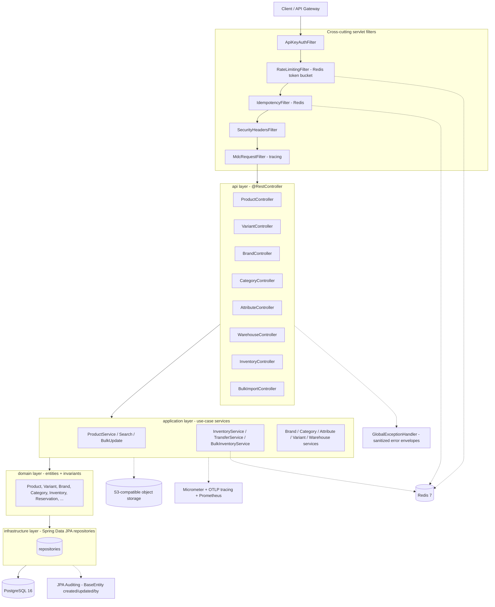

# catalog-api

A production-grade catalog/product REST API for e-commerce backends. It manages the full product domain — products and their variants, brands, categories (as a materialized-path tree), product attributes, warehouses, and per-warehouse inventory with reservations, transfers, and an append-only audit journal — plus asynchronous bulk CSV import for products and inventory. It is built with Spring Boot 3.4 on Java 21 (virtual threads), backed by PostgreSQL for storage and full-text/trigram search, and Redis for distributed rate limiting and idempotency. It is intended for internal/back-office and service-to-service use behind an API gateway, not as a public unauthenticated endpoint.

## Architecture

The codebase follows a Clean/Hexagonal layering, organized by bounded context (`product`, `variant`, `brand`, `category`, `attribute`, `warehouse`, `inventory`, `media`). Each context is split into `api` (controllers + DTOs), `application` (use-case services), `domain` (entities + business rules), and `infrastructure` (Spring Data repositories).



## Tech Stack

| Component | Technology | Version |
|---|---|---|
| Language | Java | 21 |
| Framework | Spring Boot | 3.4.5 |
| Build | Maven | 3.9+ (Dockerfile builds with 3.9.9) |
| Database | PostgreSQL | 16 (Alpine image); driver via Spring Boot BOM |
| Migrations | Flyway (core + postgresql) | 10.22.0 |
| Cache / rate limit / idempotency | Redis (Lettuce client) | 7 (Alpine image) |
| In-process cache | Caffeine | via Spring Boot BOM |
| ORM | Hibernate / Spring Data JPA | via Spring Boot 3.4.5 |
| Query | QueryDSL (jakarta) | 5.1.0 |
| Mapping | MapStruct | 1.6.3 |
| Boilerplate | Lombok | 1.18.36 |
| Object storage | AWS SDK v2 (S3) | BOM 2.25.11 |
| Rate limiting (fallback) | Bucket4j | 8.10.1 |
| Resilience | Resilience4j (Spring Boot 3) | 2.2.0 |
| Observability | Micrometer Tracing (OTel bridge), OTLP exporter, Prometheus registry | via Spring Boot BOM |
| JSON logging | logstash-logback-encoder | 7.4 |
| CSV | commons-csv | 1.10.0 |
| Testing | JUnit 5, Testcontainers (postgresql, junit-jupiter), WireMock | Testcontainers 1.21.4, WireMock 3.0.4 |
| Coverage | JaCoCo | 0.8.15 |
| Security audit | OWASP dependency-check | 9.0.9 |

## Prerequisites

| Tool | Version | Required for |
|---|---|---|
| JDK | 21 | Runtime + build |
| Maven | 3.9+ | Build |
| Docker | Engine with a running daemon | Tests (Testcontainers) and the easiest local Postgres/Redis |
| PostgreSQL | 16 | Runtime datastore (via Docker or a local install) |
| Redis | 7 | Runtime rate limiting + idempotency (via Docker or a local install) |

Docker is **required for the test suite**: integration tests spin up PostgreSQL via Testcontainers, so the Docker daemon must be running. For runtime you may use either Dockerized or natively-installed PostgreSQL and Redis.

## Local Setup

```bash
# 1. Clone
git clone <repository-url> catalog-api
cd catalog-api

# 2. Configure environment
#    Copy .env.example to .env and set your local credentials.
#    .env is gitignored and is the source of truth for local dev.
cp .env.example .env

# 3. Start PostgreSQL + Redis (docker-compose defines both)
make docker-up
#   equivalent to: docker-compose up -d postgres redis
#   Postgres -> 5432 (db=catalog_db, user=postgres, password=change-me)
#   Redis    -> 6379

# 4. Run the app
#    The app requires DB_URL, DB_USERNAME, and DB_PASSWORD to be set.
#    In IntelliJ, these are configured in the CatalogApplication run configuration.
#    From CLI, ensure they are exported or provided:
mvn spring-boot:run

# 5. Verify it is up
curl http://localhost:8080/actuator/health
#    expect: {"status":"UP", ...}
```
# 6. Smoke-test a read endpoint
curl http://localhost:8080/api/v1/categories/tree
```

To run the whole stack (app + Postgres + Redis) in containers instead, use `docker-compose up --build` — the `app` service runs with `SPRING_PROFILES_ACTIVE=prod`, which turns API-key auth **on** by default (see Environment Variables).

## Environment Variables

All variables are read from `application.yml` / `application-prod.yml`. Defaults shown are the literal fallbacks in the config.

| Variable | Required | Default | Description |
|---|---|---|---|
| `SPRING_PROFILES_ACTIVE` | No | `local` | Active Spring profile (`local`, `prod`, `test`). |
| `PORT` | No | `8080` | HTTP listen port. |
| `SPRING_DATASOURCE_URL` | No | `jdbc:postgresql://localhost:5432/catalog_db` | JDBC URL for PostgreSQL. |
| `SPRING_DATASOURCE_USERNAME` | No | `postgres` | Database username. |
| `SPRING_DATASOURCE_PASSWORD` | No | _(empty)_ | Database password. |
| `REDIS_HOST` | No | `localhost` | Redis host. |
| `REDIS_PORT` | No | `6379` | Redis port. |
| `REDIS_PASSWORD` | No | _(empty)_ | Redis password. |
| `CORS_ALLOWED_ORIGINS` | No | `http://localhost:3000` | Allowed CORS origins. |
| `CATALOG_REQUIRE_API_KEY` | No | `false` (`true` under `prod`) | Enforce `X-Api-Key` on mutating `/api/**` requests. |
| `CATALOG_API_KEYS` | Conditionally | _(empty)_ | Comma-separated valid API keys. **Required when `CATALOG_REQUIRE_API_KEY=true`** — if empty, mutating requests fail closed (500). |
| `CATALOG_INVENTORY_RETRY_MAX_ATTEMPTS` | No | `10` | Optimistic-lock retry attempts for inventory writes. |
| `CATALOG_INVENTORY_RETRY_INITIAL_DELAY_MS` | No | `25` | Initial backoff delay for inventory retries. |
| `CATALOG_INVENTORY_RETRY_MULTIPLIER` | No | `1.5` | Backoff multiplier for inventory retries. |
| `CATALOG_BULK_PRODUCT_MAX_FILE_SIZE_BYTES` | No | `10485760` | Max product bulk-import file size. |
| `CATALOG_BULK_INVENTORY_MAX_FILE_SIZE_BYTES` | No | `10485760` | Max inventory bulk-import file size. |
| `S3_BUCKET_NAME` | No | _(empty)_ | Object-storage bucket for product media. |
| `S3_ENDPOINT` | No | _(empty)_ | S3-compatible endpoint URL. |
| `S3_BASE_URL` | No | _(empty)_ | Public base URL for stored objects. |
| `AWS_REGION` | No | `us-east-1` | AWS/S3 region. |
| `AWS_ACCESS_KEY_ID` | No | _(empty)_ | S3 access key. |
| `AWS_SECRET_ACCESS_KEY` | No | _(empty)_ | S3 secret key. |
| `TRACING_SAMPLE_RATE` | No | `0.1` | Trace sampling probability. |
| `OTLP_ENDPOINT` | No | `http://localhost:4318/v1/traces` | OTLP traces endpoint. |
| `ENVIRONMENT` | No | `prod` | Value of the `environment` metrics tag. |
| `LOG_LEVEL_CATALOG` | No | `INFO` | Log level for `com.catalog`. |

## API Reference

Base URL: `http://<host>:<port>`. Successful responses use the envelope `{ "success": true, "message": <string|null>, "data": <payload>, "timestamp": <instant> }`. Errors use a sanitized envelope `{ "status", "error", "message", "path", "timestamp", "validationErrors"? }` produced by `GlobalExceptionHandler`.

**Mutating requests (`POST`/`PUT`/`PATCH`/`DELETE`) require an `X-Idempotency-Key` header** (a UUID) — missing it yields `400`. When `CATALOG_REQUIRE_API_KEY=true`, mutating `/api/**` requests also require a valid `X-Api-Key` header (else `401`). All endpoints are rate limited (`429` with `Retry-After: 60` when exceeded).

### Products — `/api/v1/products`

| Method | Path | Request Body | Response | Codes |
|---|---|---|---|---|
| POST | `/api/v1/products` | `CreateProductRequest` | `ProductResponse` | 201, 409, 422 |
| POST | `/api/v1/products/bulk-update` | multipart: `importSessionId` (UUID), `file` | `BulkProductUpdateJob` | 202 |
| GET | `/api/v1/products/bulk-update/{jobId}` | — | `BulkProductUpdateJob` | 200, 404 |
| GET | `/api/v1/products/search` | query params (below) | `CursorPage<ProductCardDto>` | 200 |
| GET | `/api/v1/products/admin` | query params (below) | `PagedResponse<ProductSummaryResponse>` | 200 |
| GET | `/api/v1/products/{id}` | — | `ProductResponse` | 200, 404 |
| GET | `/api/v1/products/slug/{slug}` | — | `ProductResponse` | 200, 404 |
| PATCH | `/api/v1/products/{id}/status` | `UpdateProductStatusRequest` | `ProductResponse` | 200, 404, 422 |
| PUT | `/api/v1/products/{id}` | `UpdateProductRequest` | `ProductResponse` | 200, 404, 422 |
| POST | `/api/v1/products/{id}/categories/{categoryId}` | — | `ProductResponse` | 200, 404 |
| DELETE | `/api/v1/products/{id}/categories/{categoryId}` | — | `ProductResponse` | 200, 404 |
| DELETE | `/api/v1/products/{id}` | — | _(message only)_ | 200, 404 |

`search` params: `categoryId`, `brandId`, `minPrice`, `maxPrice`, `attributeValueIds` (set), `inStock`, `search`, `sort` (default `NEWEST`), `cursor`, `pageSize` (1–100, default 20).
`admin` params: `statuses` (set), `categoryId`, `brandId`, `search`, `page` (default 0), `size` (≤200, default 50), `sort` (default `NEWEST`).

### Variants — `/api/v1/products/{productId}/variants`

| Method | Path | Request Body | Response | Codes |
|---|---|---|---|---|
| POST | `/api/v1/products/{productId}/variants` | `CreateVariantRequest` | `VariantResponse` | 201, 404, 422 |
| GET | `/api/v1/products/{productId}/variants` | — | `List<VariantSummaryResponse>` | 200, 404 |
| GET | `/api/v1/products/{productId}/variants/{id}` | — | `VariantResponse` | 200, 404 |
| PATCH | `/api/v1/products/{productId}/variants/{id}/status` | `UpdateVariantStatusRequest` | `VariantResponse` | 200, 404, 422 |
| PUT | `/api/v1/products/{productId}/variants/{id}` | `UpdateVariantRequest` | `VariantResponse` | 200, 404, 422 |
| DELETE | `/api/v1/products/{productId}/variants/{id}` | — | _(message only)_ | 200, 404 |

### Brands — `/api/v1/brands`

| Method | Path | Request Body | Response | Codes |
|---|---|---|---|---|
| POST | `/api/v1/brands` | `CreateBrandRequest` | `BrandResponse` | 201, 409, 422 |
| GET | `/api/v1/brands` | query: `search`,`active`,`featured`,`country`,`page`,`size`(≤100),`sortBy`,`sortDir` | `PagedResponse<BrandResponse>` | 200 |
| GET | `/api/v1/brands/featured` | — | `List<BrandSummaryResponse>` | 200 |
| GET | `/api/v1/brands/{id}` | — | `BrandResponse` | 200, 404 |
| GET | `/api/v1/brands/slug/{slug}` | — | `BrandResponse` | 200, 404 |
| PUT | `/api/v1/brands/{id}` | `UpdateBrandRequest` | `BrandResponse` | 200, 404, 422 |
| DELETE | `/api/v1/brands/{id}` | — | _(message only)_ | 200, 404 |

### Categories — `/api/v1/categories`

| Method | Path | Request Body | Response | Codes |
|---|---|---|---|---|
| POST | `/api/v1/categories` | `CreateCategoryRequest` | `CategoryResponse` | 201, 409, 422 |
| GET | `/api/v1/categories/{id}` | — | `CategoryResponse` | 200, 404 |
| GET | `/api/v1/categories/slug/{slug}` | — | `CategoryResponse` | 200, 404 |
| GET | `/api/v1/categories/tree` | — | `List<CategoryTreeResponse>` | 200 |
| GET | `/api/v1/categories/{id}/subtree` | — | `CategoryTreeResponse` | 200, 404 |
| GET | `/api/v1/categories/{id}/children` | — | `List<CategoryResponse>` | 200, 404 |
| GET | `/api/v1/categories/{id}/ancestors` | — | `List<CategorySummaryResponse>` | 200, 404 |
| PUT | `/api/v1/categories/{id}` | `UpdateCategoryRequest` | `CategoryResponse` | 200, 404, 422 |
| DELETE | `/api/v1/categories/{id}` | — | _(message only)_ | 200, 404 |

### Attributes — `/api/v1/attributes`

| Method | Path | Request Body | Response | Codes |
|---|---|---|---|---|
| POST | `/api/v1/attributes/types` | `CreateAttributeTypeRequest` | `AttributeTypeResponse` | 201, 409, 422 |
| GET | `/api/v1/attributes/types` | — | `List<AttributeTypeResponse>` | 200 |
| POST | `/api/v1/attributes/types/{typeId}/values` | `CreateAttributeValueRequest` | `AttributeValueResponse` | 201, 404, 409, 422 |
| GET | `/api/v1/attributes/types/{typeId}/values` | — | `List<AttributeValueResponse>` | 200, 404 |

### Warehouses — `/api/v1/warehouses`

| Method | Path | Request Body | Response | Codes |
|---|---|---|---|---|
| POST | `/api/v1/warehouses` | `CreateWarehouseRequest` | `WarehouseResponse` | 201, 409, 422 |
| GET | `/api/v1/warehouses` | query: `page`,`size`(≤200) | `PagedResponse<WarehouseResponse>` | 200 |
| GET | `/api/v1/warehouses/{id}` | — | `WarehouseResponse` | 200, 404 |
| PUT | `/api/v1/warehouses/{id}` | `UpdateWarehouseRequest` | `WarehouseResponse` | 200, 404, 422 |
| PATCH | `/api/v1/warehouses/{id}` | `UpdateWarehouseRequest` | `WarehouseResponse` | 200, 404, 422 |

### Inventory — `/api/v1/inventory`, `/api/v1/variants/...`, `/api/v1/transfers`

| Method | Path | Request Body | Response | Codes |
|---|---|---|---|---|
| POST | `/api/v1/inventory` | `CreateInventoryRequest` | `InventoryResponse` | 201 (+`Location`), 422 |
| GET | `/api/v1/inventory/{id}` | — | `InventoryResponse` | 200, 404 |
| GET | `/api/v1/variants/{variantId}/inventory` | — | `List<InventoryResponse>` | 200 |
| GET | `/api/v1/variants/{variantId}/inventory/warehouses/{warehouseId}` | — | `InventoryResponse` | 200, 404 |
| PATCH | `/api/v1/inventory/{id}/stock` | `AdjustStockRequest` | `InventoryResponse` | 200, 404, 422 |
| POST | `/api/v1/inventory/reservations` | `CreateReservationRequest` | `ReservationResponse` | 201, 422 |
| POST | `/api/v1/inventory/reservations/{id}/complete` | — | `ReservationResponse` | 200, 404 |
| POST | `/api/v1/inventory/reservations/{id}/cancel` | — | `ReservationResponse` | 200, 404 |
| POST | `/api/v1/inventory/transfers` **or** `/api/v1/transfers` | `TransferStockRequest` | `TransferResponse` | 201, 404, 422 |
| GET | `/api/v1/inventory/{inventoryId}/journal` | query: `page`,`size`(≤200) | `PagedResponse<InventoryJournalResponse>` | 200, 404 |

### Bulk inventory import — `/api/v1/inventory/bulk-imports`

| Method | Path | Request Body | Response | Codes |
|---|---|---|---|---|
| POST | `/api/v1/inventory/bulk-imports` | multipart: `file`, `importSessionId` (UUID) | `BulkImportJobResponse` | 202 |
| GET | `/api/v1/inventory/bulk-imports/{jobId}` | — | `BulkImportJobResponse` | 200, 404 |

### Operational endpoints (Actuator)

`GET /actuator/health` (with `liveness`/`readiness` groups), `/actuator/info`, `/actuator/metrics`, `/actuator/prometheus`. Exposure is narrowed to `health,info,prometheus` under the `prod` profile.

## Database

Schema is managed by Flyway migrations `V1`–`V17` under `src/main/resources/db/migration`. Extensions enabled (`V1`): `pgcrypto`, `pg_trgm`, `unaccent`, `pg_stat_statements`.

| Table | Purpose | Notable columns / constraints |
|---|---|---|
| `categories` | Category tree (materialized path) | `path`, `depth`, `parent_id`; unique `uq_categories_slug` |
| `brands` | Brands | unique `uq_brands_slug`, `uq_brands_name` |
| `products` | Products | `status`, `slug`, `brand_id`, `primary_category_id`; unique `uq_products_slug` |
| `product_categories` | Product↔secondary-category join | — |
| `attribute_types` / `attribute_values` | Attribute taxonomy | unique `uq_attribute_types_name`, `uq_attribute_values_type_value` |
| `variants` | SKU-level variants | unique `uq_variants_internal_sku`, `uq_variants_merchant_sku` |
| `variant_attribute_values` | Variant↔attribute-value join | — |
| `warehouses` | Warehouses | partial unique `uq_warehouses_code` (active rows) |
| `inventory` | Stock per (variant, warehouse) | partial unique `uq_inventory_variant_warehouse_active`; quantity CHECK constraints |
| `inventory_reservations` | Stock reservations | partial unique `uq_ir_active_inventory_reference`; FK `ir_inventory_fk` |
| `inventory_journal` | Append-only inventory audit log | `operation_type`, before/after/delta quantities |
| `product_images` / `variant_images` | Media metadata | partial unique primary-image indexes |
| `product_search_projection` | Denormalized search read model | `searchable_text TSVECTOR`; GIN-indexed |
| `bulk_import_jobs` / `product_bulk_jobs` | Async import job tracking | unique session indexes |
| `orders` / `order_line_items` | Order records + reservation idempotency | created in `V12` |

Indexing highlights:
- **GIN full-text**: `idx_psp_searchable_text` on `product_search_projection.searchable_text` (`TSVECTOR`).
- **GIN trigram** (`gin_trgm_ops`): `idx_products_name_trgm`, `idx_brands_name_trgm`, `idx_categories_name_trgm`, `idx_psp_name_trgm`.
- **Partial B-tree** for soft-delete & hot paths: `idx_inventory_variant_id`, `idx_inventory_warehouse_id`, `idx_inventory_low_stock`, `idx_ir_active_expired`, `idx_warehouses_active`, plus the partial unique indexes above.
- **Cursor pagination**: `idx_psp_created_at_cursor`, `idx_products_status_created_at`.

## Running Tests

```bash
# Unit + integration tests + merged JaCoCo coverage (Docker daemon must be running)
mvn clean verify -Ddependency-check.skip=true

# Unit (surefire) tests only
mvn test
```

OWASP dependency-check is wired into the `verify` lifecycle; pass `-Ddependency-check.skip=true` for fast local runs.

Integration tests (`*IT`) use **Testcontainers**, which requires a running Docker daemon — they start a `postgres:16-alpine` container automatically (no manual DB setup needed). `@SpringBootTest` ITs share a single Testcontainers Postgres instance (singleton-container pattern) and truncate all tables before each test for isolation; repository slice tests (`@DataJpaTest`) start their own container.

Coverage: the merged JaCoCo report (unit + integration) is written to **`target/site/jacoco-merged/index.html`** — open it in a browser after `mvn verify`.

## Key Design Decisions

- **Clean architecture by bounded context.** Each context isolates `api`/`application`/`domain`/`infrastructure`. The tradeoff is more packages/boilerplate (and MapStruct mappers between DTOs and entities) in exchange for domain logic with no Spring/web dependencies, unit-testable in isolation. Entities never leak past the `api` layer — controllers return record DTOs only.

- **PostgreSQL GIN indexes for search.** Name/fuzzy search uses `pg_trgm` GIN indexes and the read model uses a `TSVECTOR` GIN index, rather than adding a separate engine (Elasticsearch/OpenSearch). For a single-store catalog this avoids the operational cost and dual-write consistency problems of an external index while still giving sub-linear full-text and trigram search. A denormalized `product_search_projection` keeps query-time joins off the hot path.

- **Atomic Redis token-bucket rate limiting.** `RateLimitingFilter` consumes tokens via a single atomic Redis operation (`RedisTokenBucketRateLimiter.tryConsume`) keyed per client/path/method, tiered (reads 100/min, writes 20/min, bulk 5/min). A non-atomic "read count, compare, then increment" approach has a check-then-act race: two concurrent requests both read a count under the limit and both proceed, allowing bursts past the cap. Doing the decrement-and-test atomically server-side closes that window. If Redis is unavailable the filter fails open to a Bucket4j in-memory fallback rather than rejecting traffic.

- **Virtual threads (Java 21).** `spring.threads.virtual.enabled=true` runs request handling on virtual threads. This API is I/O-bound (PostgreSQL, Redis, S3), so virtual threads service many concurrent blocking requests without a large OS-thread pool, improving throughput under concurrency while keeping straightforward blocking JDBC code.

- **Soft delete with partial unique indexes.** Rows carry `deleted_at`; "active" queries filter `deleted_at IS NULL`. Uniqueness (brand slug, warehouse code, one inventory row per variant+warehouse) is enforced by *partial* unique indexes scoped to non-deleted rows. This preserves history and lets a slug/code be reused after the original is soft-deleted, which a plain unique constraint would forbid.

- **Optimistic locking with bounded retry for inventory.** Inventory writes use JPA `@Version` optimistic locking and retry on conflict with exponential backoff (`CATALOG_INVENTORY_RETRY_*`). Under hot-SKU contention this avoids row locks/deadlocks while still guaranteeing no lost updates; the append-only `inventory_journal` records every quantity change for auditability.

- **Idempotent mutations.** `IdempotencyFilter` requires an `X-Idempotency-Key` (UUID) on every mutation and caches the response in Redis, replaying it (with `X-Idempotency-Replayed: true`) on retries — so client retries after a network blip don't double-create resources or double-apply stock changes.

## Further Reading
- [ARCHITECTURE.md](ARCHITECTURE.md) — Deep dive into design decisions.
- [API.md](API.md) — Full endpoint documentation.
- [AUDIT_REPORT.md](AUDIT_REPORT.md) — Audit findings, fixes, and verification record.
- [docs/adr/](docs/adr/) — Architecture Decision Records.
